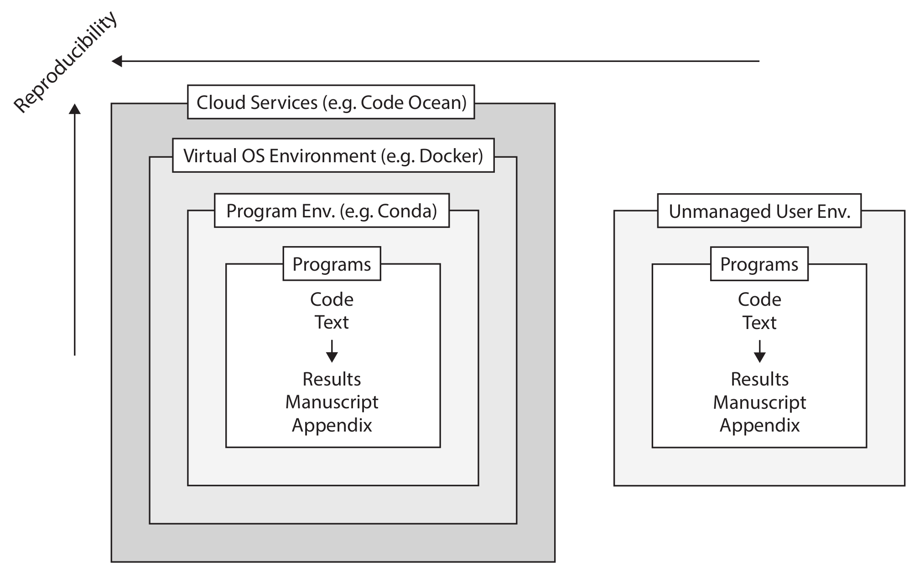

# Replizierbarkeit und Kollaboration im Forschungsalltag: Praktische Empfehlungen

Maximilian Sprengholz (HU Berlin & BIM)
Colloquium Empirische Methoden der Sozialforschung. 05/23

---

<!-- paginate: true -->

# Problemstellung

- Wissenschaftliche Ergebnisse sollen reproduzierbar sein (Gayle & Connelly 2022):
  1. __Duplication:__ Exakte Replikation gegeben derselben Daten, Methoden <br> $\rightarrow$ rein technische Hürde
  2. __Replication:__ Freie Replikation mit anderen Daten, Methoden (siehe Breznau et al. 2022)
- __Never change a running system__: Das Problem entsteht erst, weil wir nicht wissen, warum es überhaupt lief
- Bei Kooperationen mit anderen Wissenschaftler*innen haben wir im Kleinen, was generelle Replizierbarkeit im Großen ist: Wir müssen auf robuste, weitestgehend universelle Standards einigen und diese bestmöglich dokumentieren
- Es ist kompliziert!

---

[American Economic Review](https://www.aeaweb.org/journals/data/data-code-policy)

>It is the policy of the American Economic Association to publish papers only if the data and code used in the analysis are clearly and precisely documented and access to the data and code is non-exclusive to the authors.

[European Sociological Review](https://academic.oup.com/esr/pages/General_Instructions)

>Where ethically feasible, European Sociological Review strongly encourages authors to make all data and software code on which the conclusions of the paper rely available to readers. Authors are required to include a Data Availability Statement in their article. This policy applies to all papers submitted to the journal on or after 5 September 2022.

---

# Was soll replizierbar sein?

- __Im besten Fall alles!__
  - Datenaufbereitung
  - Analyse
  - Dokumente
- Replizierbarkeit zwar ist kein Kontinuum...
- ...aber mit ein paar Basics kommen wir schon ziemlich weit :thumbsup:

---

 

---

# Wir brauchen Struktur: Self-contained Projects (und gute Computerpraxis)

- Jedes Projekt sollte einen festen Ort mit einer sinnvollen (selbsterklärenden) __Ordnerstruktur__ haben
- Wie _genau_ diese aussieht, ist nicht so wichtig, so lange ein paar grundlegende Regeln beachtet werden (siehe exzellentes How-To zu "good enough practices", Wilson et al. 2017)
- Bei regelmäßig neuen Projekten empfiehlt sich eine Automatisierung, bspw. über `cookiecutter`
<!-- - Wenn ihr selbst nicht mehr wisst, wo eigentlich was liegt, wird sich keine andere Person besser zurecht finden -->
<!-- - Reproduzierbarkeit ist eine lineare Funktion der Regelhaftigkeit -->

```bash
conda install cookiecutter -c conda-forge
cookiecutter gh:maximilian-sprengholz/good-enough-project
```

---

- Minimal notwendiger Input wenn Projekte transferiert werden / von mehreren Personen genutzt werden: 
  - __working directory__ `wd` +
  - __relative Pfade__ `wd/src/00_master.do`, `wd/results/figures/myplot.pdf` (forward slashed + no spaces + no special characters)
- __Master Files:__ Hier werden `wd` und alles andere defininiert und alle Syntaxen gestartet
- Bereitstellung aller notwendigen Files oder entsprechender Konfigurationen, welche die Files rekonstruieren können
- __Raw__ Daten sind tabu!

---

# Dependency management

- Egal ob `R`, `Stata`, oder `Python`: Software + Erweiterungen ändern sich ständig $\rightarrow$ es geht nicht ohne projektspezifische, replizierbare Environments!
- `conda` (Anaconda, Miniconda, Mamba) hilft dabei:
  - Im weitesten Sinne ein Environment & Paketmanager
  - Wurde für `Python` entwickelt, aber installierbare Pakete sind nicht auf `Python` beschränkt (bspw. `Pandoc`, `R`)
  - Hat ein automatisches _dependency management_ (anders als bspw. `pip`)
- Nicht immer ist `conda` notwendig bzw. die beste Lösung:
  - `Stata` unterstützt keinerlei automatisches dependency management
  - `R`: Paket `renv` sieht sehr vielversprechend aus
  - `Python`: functioniert am besten mit `conda` bzw. `pip`

<!-- Christian: KHB.ado version 17 -->

---

# Version Control mit `git`

- Kollaborative (Software-)Entwicklung mit Versionskontrolle
- Versionskontrolle des eigenen Projektordners (repository) sehr nützlich: lokal arbeiten, Änderungen remote speichern
- Tracking ist zeilenbasiert: Git funktioniert am besten mit Dateien im Syntax/Markup-Format (alle Programmiersprachen, aber auch `LaTeX`, `Markdown`)
- Kollaboration: Erfordert händischen `merge` wenn mehrere Personen die gleiche Stelle des Files bearbeiten
- Die HU betreibt eine eigene [GitLab](https://scm.cms.hu-berlin.de) Instanz, öffentliche und private repositories inklusive

---

- Fixe Grundstruktur + `git`: Projekte bleiben viel sauberer: Im Idealfall gibt es nur noch `myfile.do` mit gespeichertem Changelog und nicht mehr `myfile1.do`, `myfile2.do`, `myfile_final.do`, `myfile_FINALFINAL.do` ...
- Es kann trotzdem alles probiert werden lokal (oder in branches, forks): `commit`/`merge` selektiv + `.gitignore`
- Es geht nichts verloren!
- `git` ist ein Command Line Tool, aber es gibt sehr viele verschiedene GUIs, die wesentlich intuitiver sind (siehe Links am Ende)
- Plattformen wie `GitHub` und `GitLab`: Viele weitere nützliche Tools, z.B. GUI, Issues, Milestones, CI

<!-- git graph -->

---

# Kollaboration beim Schreiben

- `Word` ist der Standard, hat aber folgende Nachteile:
  - Gleichzeitiges Arbeiten nur in der reduzierten Online-Version möglich
  - Offline: Keine zeilenbasierte Versionskontrolle
  - Dynamische Dokumente kompliziert, teilw. unmöglich
  - Die meisten Nachteile gelten auch für bspw. `OnlyOffice`
- Synchronisierung ist notwendig: 
  - Der schlimmste Ansatz: Dokumente im "E-Mail-Umlaufverfahren"
  - Kein Problem mit `git`, aber auch mit jeder Cloud möglich (z.B. [HU Box](box.hu-berlin.de))
  - Dedizierte Services: [Overleaf](https://www.overleaf.com/) (Online `LaTeX`, [HU Instanz](https://latex.hu-berlin.de)), [Authorea](https://www.authorea.com/)
- Trennung Analyse + Schreiben? Muss nicht: `RMarkdown`

---

# Die Kür: Vollständige Automatisierung

- Im Idealfall müssen andere Wissenschaftler*innen _nichts_ in den Projektfiles anpassen
- Da oft ein paar Infos übergeben werden müssen, kann dies aber über Argumente an ein Automatisierungstool geschehen, welches alles startet: <br> Master vom Master :dizzy_face:
- Es gibt viele verschiedene, z.B. `make`

---

# Projektveröffentlichung

- Ein sauberes und gut dokumentiertes Repository ist im Idealfall direkt reproduzierbar und kann ohne viel zusätzlichen Aufwand veröffentlicht bzw. zur Verfügung gestellt werden
- Ziel: Open Access Hosting der Repositories mit Versionierung, Metadaten und DOI
- Mögliche Plattformen sind [OSF](https://www.osf.io/), [Zenodo](https://www.zenodo.org/) und (kostenpflichtig) [CodeOcean](https://www.codeocean.com)
- Einige der Plattformen haben Integration mit den großen `git` Plattformen, so dass eigene repositories bei release z.B. direkt von GitHub zu Zenodo gepusht werden
- [OSF Beispiel](https://osf.io/y7d4q/), [Zenodo Beispiel](https://zenodo.org/record/7670946#.ZGR0ORlBwUE)
- [CodeOcean Beispiel](https://doi.org/10.24433/CO.7980425.v1)

---

# Links

- [Die Präsentation und Beispielsetups]((https://scm.cms.hu-berlin.de/sprenmax/repro-collab)) für `R` und `Stata` findet ihr auf `GitLab`
- [Großartiger Kurs](https://ecorepsci.github.io/reproducible-science/index.html) von Simona Picardi (Basics generell nutzbar, Rest `R`)
- [`cookiecutter`](https://github.com/cookiecutter/cookiecutter)
- [HU Git Instanz](https://scm.cms.hu-berlin.de), [GitHub](https://www.github.com) 
- Freie und plattformunabhängige Git GUI Clients: [SmartGit](https://www.syntevo.com/smartgit/), [GitFiend](https://gitfiend.com/), [Gitnuro](https://gitnuro.jetpackduba.com/); VScode Extensions z.B. [`gittree`](https://marketplace.visualstudio.com/items?itemName=mhutchie.git-graph)
- Online LaTeX mit Overleaf: [HU Instanz](https://latex.hu-berlin.de), [Offizielle Domain](https://www.overleaf.com/)
- [`conda`](https://docs.conda.io/en/latest/miniconda.html)
- `R`: [`renv`](https://rstudio.github.io/renv/articles/renv.html)

---

# References

<style scoped>
p {
  font-size: 15px; 
  line-height: 20px;
  padding-left: 22px ;
  text-indent: -22px ;
}
</style>
Breznau, N., Rinke, E. M., Wuttke, A., Nguyen, H. H. V., Adem, M., Adriaans, J., Alvarez-Benjumea, A., Andersen, H. K., Auer, D., Azevedo, F., Bahnsen, O., Balzer, D., Bauer, G., Bauer, P. C., Baumann, M., Baute, S., Benoit, V., Bernauer, J., Berning, C., … Żółtak, T. (2022). Observing many researchers using the same data and hypothesis reveals a hidden universe of uncertainty. Proceedings of the National Academy of Sciences, 119(44), e2203150119. https://doi.org/10.1073/pnas.2203150119

Gayle, V., & Connelly, R. (2022). The Stark realities of reproducible statistically orientated sociological research: Some newer rules of the sociological method. Methodological Innovations, 15(3), 207–221. https://doi.org/10.1177/20597991221111681

Wilson, G., Bryan, J., Cranston, K., Kitzes, J., Nederbragt, L., & Teal, T. K. (2017). Good enough practices in scientific computing. PLOS Computational Biology, 13(6), e1005510. https://doi.org/10/gbkbwp
